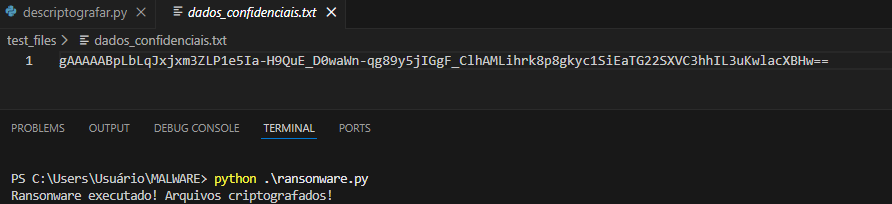
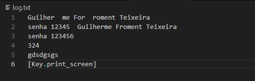
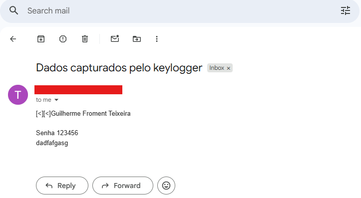

# 🦠 Simulador de Malware: Ransomware & Keylogger com Exfiltração

## 📝 Descrição
Este projeto foi desenvolvido como parte do **Bootcamp de Cibersegurança do Santander** (2025) em parceria com a **DIO**. 

O objetivo foi desenvolver scripts em **Python** para simular o ciclo de vida completo de ameaças cibernéticas em ambiente controlado:
1.  **Ransomware:** Sequestro de dados via criptografia.
2.  **Keylogger Avançado:** Espionagem de teclado com **exfiltração automática de dados via E-mail**.

⚠️ **Aviso:** Este projeto tem fins estritamente educacionais. A execução foi realizada em ambiente controlado para estudo de comportamento de malware e desenvolvimento de defesas (Blue Team).

## 🛠️ Tecnologias Utilizadas
* **Python 3:** Linguagem base.
* **Bibliotecas:** `cryptography` (AES), `pynput` (Monitoramento) e `smtplib` (Envio de E-mail).
* **VS Code:** Ambiente de desenvolvimento.

## 🚀 Funcionalidades Implementadas

### 1. Ransomware (Criptografia)
Script que localiza arquivos alvo e utiliza criptografia simétrica para torná-los ilegíveis. Inclui um descodificador para recuperação.
* **Arquivo:** `ransonware.py` e `descriptografar.py`

### 2. Keylogger (Espionagem Local Furtiva)
Script que captura inputs do teclado e salva num log local.
* **Técnica Stealth:** O arquivo foi configurado com extensão `.pyw` para rodar em segundo plano, sem abrir janela de terminal.
* **Arquivo:** `keylogger.pyw`

### 3. Exfiltração de Dados (Data Theft)
Funcionalidade avançada que conecta a um servidor SMTP (Gmail) e envia o log de teclas capturadas diretamente para o e-mail do atacante, simulando um cenário de vazamento de credenciais.
* **Arquivo:** `keylogger_email.py`

---

## 🛡️ Reflexão sobre Defesa (Blue Team)
A implementação prática destes ataques evidencia as camadas de defesa necessárias:

1.  **Contra Ransomware:** Backups offline são a única garantia, além de controle rigoroso de permissões de usuário.
2.  **Contra Exfiltração (DLP):** * **Monitoramento de Rede:** Bloquear tráfego de saída (outbound) para portas SMTP (587/25) desconhecidas no Firewall.
    * **Análise de Comportamento:** Detetar processos não autorizados (scripts Python desconhecidos) tentando conexões externas.
3.  **MFA (Autenticação Multifator):** Essencial para mitigar o impacto de senhas roubadas pelo Keylogger.

---
*Projeto realizado por Guilherme Teixeira.*
